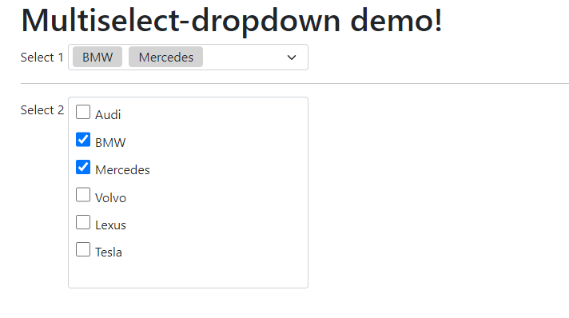

# multiselect-dropdown
Pure JavaScript, no dependencies, dropdown list with multiselect capability.

## Installation

Include multiselect-dropdown.js in your HTML.

    

## Usage

Just add "multiple" attribute to SELECT elements.
    
    <select multiple id="sel1"> 
        ... 
    </select>

### Custom Attributes

To enable dynamic list search, add multiselect-search="true" attribute.

    <select multiple 
        multiselect-search="true" 
        multiselect-select-all="true" 
        multiselect-max-items="3"
        multiselect-hide-x = "false"
    >
        ... 
    </select>

To add "select all" option, set multiselect-select-all="true" .

Attribute multiselect-max-items="3" sets maximum number of items displayed in the control.

"multiselect-hide-x", if true, hides a button to remove selected option.

### JavaScript API

To update options list, call *selectId.loadOptions()* where "selectId" is HTML select element.

    fetch("/options").then(d=>d.json()).then(d=>{
      sel1.innerHTML = 
        d.map(t=>'<option value="'+t.value+'">'+t.text+'</option>');

      sel1.loadOptions();
    })

## Demo

[Demo Page](https://admirhodzic.github.io/multiselect-dropdown/demo.html)
